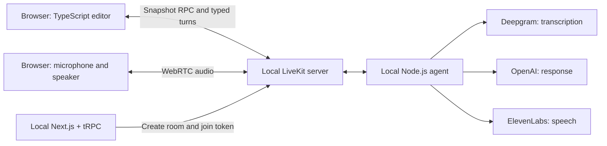

# Starter architecture

## Two paths

**Audio:** microphone → LiveKit → agent → STT → LLM → TTS → LiveKit → speaker.
Silero VAD runs locally to detect speech. No LiveKit Cloud inference or cloud noise
cancellation is required. Provider API calls do require network access and keys.

**Data:** editor snapshots, typed turns, transcripts, and errors travel over
LiveKit RPC and text streams. tRPC creates local rooms and scoped join tokens;
it is not the transport for each conversational turn.

## Capture semantics

The browser owns the editor. Each document change increments `revision`; a
`documentId` identifies its lifetime. When a spoken user turn is committed by the
agent, `onUserTurnCompleted` calls `assignment.editorSnapshot` before generation.
The browser captures its current code at RPC handling time, returning a document
ID, revision, language, and timestamp. This is **turn-end capture**, not a frame
from the instant speech began. Typed turns use the same capture RPC.

The snapshot is validated and shown in the browser. If capture fails, the agent
reports failure instead of responding using an assumed current editor. Editor
JSON is user data, not a source of higher-priority instructions. The UI marks a
snapshot when its revision differs from the editor's current revision.

## Deliberately small baseline

- A fresh room per browser connection, limited to candidate + agent. The room
  metadata pins the candidate identity. The agent accepts text turns only from it.
- Input is enabled after the agent publishes readiness, not just participant
  presence. The local worker allows four active rooms so reconnects can overlap
  briefly with old-room cleanup; this is not a production capacity configuration.
- Browser context requests and events accept only the room's agent participant.
- Snapshot RPC responses are capped at 12 KB (including UTF-8/JSON overhead).
- No application authentication or durable DB. Bind the starter to localhost.
- Mock mode runs real LiveKit RPC with deterministic text responses, but no audio
  or provider calls. It is a transport fixture, not an alternative model.
- A small in-process cache deduplicates accepted text turn IDs. It is not durable
  across agent restarts and is not a complete action-delivery protocol.
- Browser transcript display retains 100 events. There is no durable session
  history or guaranteed replay after reload. The editor is not persisted on reload.
- Provider conversation context grows during a session; a production application
  would need explicit context, retention, and cost policies.
- A keyless transport check does not verify microphone permissions, STT, TTS,
  provider credentials, spoken interruptions, or model tool use.

## Your extension

Design the messages and ownership rules for highlight, run, and proposal actions.
Decide how each action is linked to a turn and editor revision, how an action is
acknowledged, and what the agent is told when the browser cannot apply it. Add
the appropriate tool definitions to the agent and handlers to the client.

This document describes the supplied read-only behavior, not a prescribed answer
to the assignment. Explain your chosen protocol and its limits in your PR.
