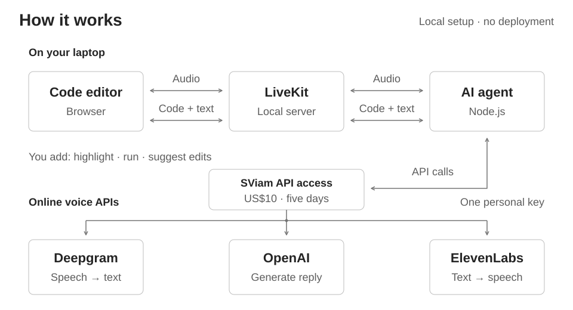
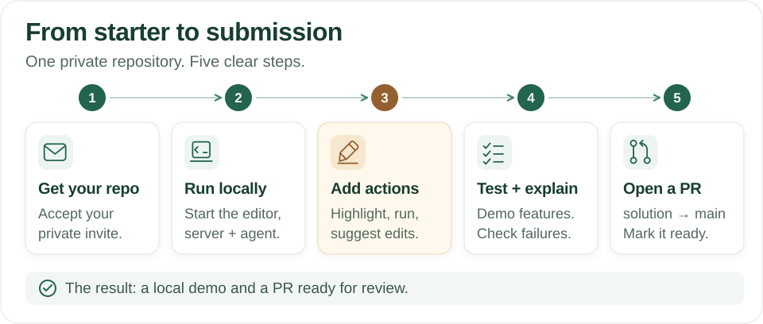

# Make the coding assistant interactive

**Already provided:** a TypeScript editor, voice connection, and an agent that can
read the code and discuss it. **You build:** the three actions below.
Everything you build runs on your laptop. No deployment, login, database, or LiveKit Cloud account is required.

[Local setup](#run-the-starter) · [API keys](#add-api-access) · [Submission](#submit)

## What you need to build

| You build | Example user request | What should happen |
| --- | --- | --- |
| **Highlight** | “Explain this function.” | The agent highlights the relevant lines while explaining. The user can clear the highlight. |
| **Run** | “Run my code.” | Show running, success, errors, timeouts, and output. The agent discusses the actual result. |
| **Suggest edits** | “Suggest a fix.” | Show the proposed change as a diff or before/after preview. Apply it only after acceptance; allow rejection. |

**The important edge case:** the user edits code while the agent is replying.
A highlight or edit for the old code must not affect unrelated new code, and an
old run result must not appear to describe the new version.

Also handle late or duplicate messages, overlapping runs, repeated acceptance,
interruptions, and failures.
Run editor code in an isolated environment with time and resource limits, outside the web or agent process.

Supporting TypeScript/JavaScript is enough; solving the sample two-sum problem is not the assignment.
You may restructure the starter—explain your choices.

## How the starter works

The browser holds the code. When the user finishes speaking, the agent asks for a
fresh copy before replying. Typed questions work the same way. LiveKit carries
the audio and messages between them. The app runs locally; voice providers need internet access.



## Run the starter



Accept your assigned repository invitation, clone it, and
open its folder. Use Node.js 22 and install [LiveKit Server](https://docs.livekit.io/transport/self-hosting/local/)
(`brew install livekit` on macOS). Then run:

```sh
npm ci
npm run setup
```

Open three terminals in the repository folder. Keep these commands running:

| Terminal | Command |
| --- | --- |
| LiveKit server | `livekit-server --dev` |
| Web app | `npm run dev` |
| Agent | `npm run agent` |

**Check that setup worked:** open **http://127.0.0.1:3000**, click **Connect agent**,
and wait for **Connected**.

1. Add `// setup check` as the first line in the editor.
2. Send `Read my code`. The reply should include `First line: // setup check`.
3. Change the comment to `// updated` and ask again. The reply should include `// updated`.

This is **mock mode**: it checks the connection without API keys, AI, or audio.
The three actions in the table will work only after you implement them.
If the connection fails, run `npm run doctor` and check that all three terminals are running.

## Add API access

The hiring team will share funded OpenAI,
Deepgram, and ElevenLabs keys, plus an ElevenLabs voice ID, privately.
If you have not received access instructions, contact the person who sent your assignment.
You do not need to buy credits or use free-tier accounts. GitHub does not issue these keys.

`npm run setup` creates `.env.local`. Replace the following settings with the
values from the team; keep the other settings as supplied:

```dotenv
AGENT_MODE=voice
OPENAI_API_KEY=replace-with-team-key
DEEPGRAM_API_KEY=replace-with-team-key
ELEVEN_API_KEY=replace-with-team-key
ELEVEN_VOICE_ID=replace-with-team-voice-id
```

Keep this file on your laptop; never put keys in a commit or PR. Restart the web
app and agent, reconnect, and click **Enable microphone**. Voice mode uses the
online providers for speech, transcript, and code context. If access fails, tell
the team; you can still check the local connection in mock mode.

## Submit

Demo the three features locally with voice, then run:

```sh
npm run check
npm run build
```

- [ ] Highlighting, code runs, and accepted/rejected edits work in a local demo.
- [ ] The PR explains your architecture, tests, failure cases, limitations, and how you checked AI-generated code.
- [ ] A `solution` → `main` PR is ready for review in **your assigned private repo**, with local demo steps.

Keep `main` unchanged. No portal upload or merge is needed. Other candidates have
no access; the owner and authorized reviewers can see your work. Use the deadline in your invitation.

## How we review it

We assess the features, state handling, execution isolation, and your ability to
explain the architecture. AI coding tools are fully allowed. We do not score the
default model's intelligence or factual accuracy, your choice of coding assistant,
provider speech/transcription quality or latency outside your control, or visual
polish beyond usability. We do assess how your app handles provider outputs and errors.

Optional: [code map and starter limitations](docs/implementation-notes.md).
